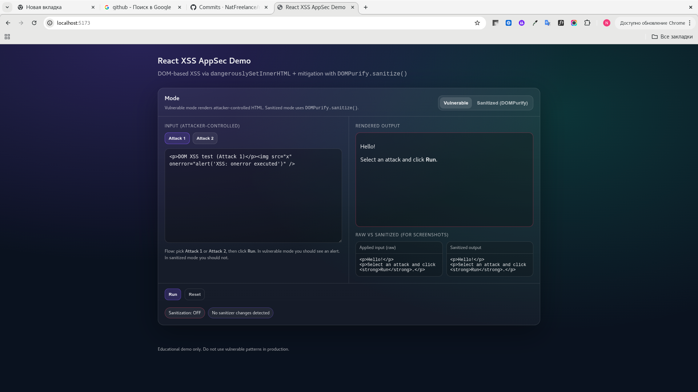
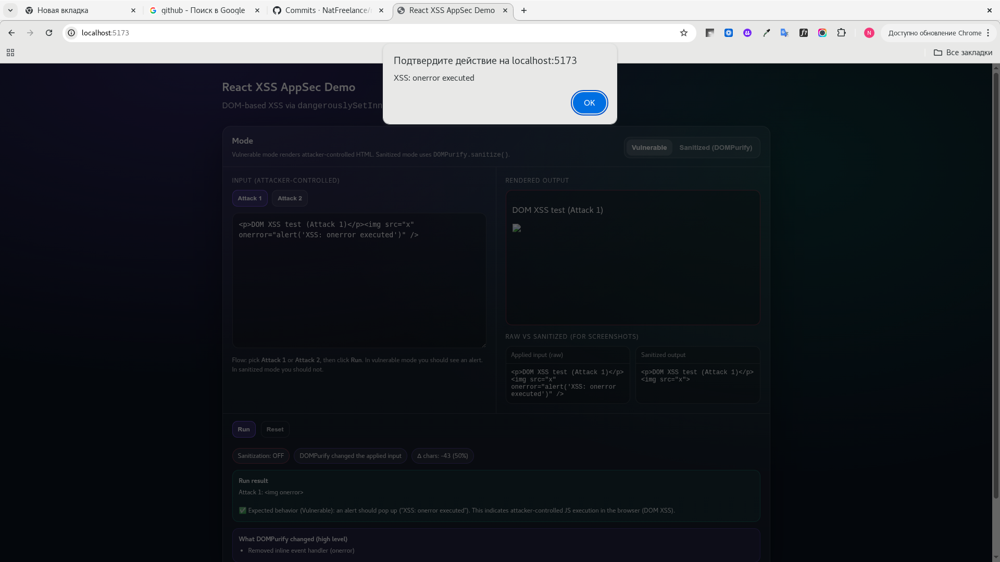
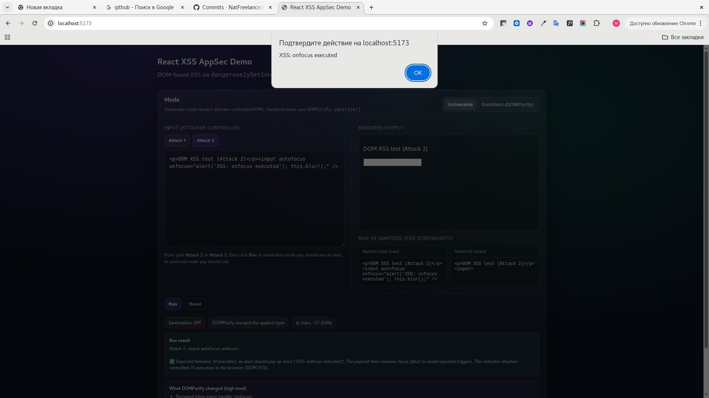
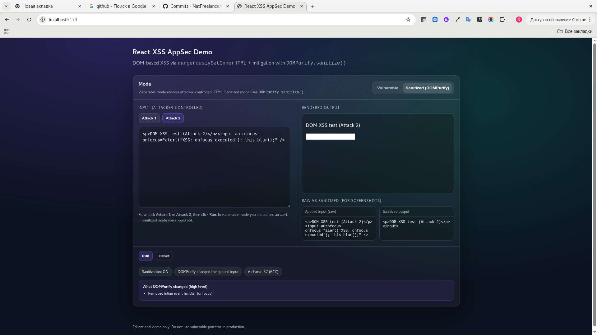

# 🔐 Application Security Demo: XSS in React

## 👩‍💻 Author

Natalia Gubar  
Application Security Engineer (in transition)  
Background: 8+ years in Information Security + Frontend Development (React, Qt/QML)

---

## 📌 Project Overview

This project demonstrates a real-world Cross-Site Scripting (XSS) vulnerability in a React application and how to properly mitigate it.

Live demo: `https://aesthetic-bubblegum-cbc86d.netlify.app`

It is designed to showcase:
- secure coding practices
- understanding of frontend attack surface
- practical AppSec skills

---

## ❌ Vulnerability: DOM-based XSS

The application contains an intentionally vulnerable component using:

`dangerouslySetInnerHTML`

This allows user-controlled input to be executed as JavaScript in the browser.

---

## 💥 Exploitation Steps

1. Install Node.js (includes npm).
   - Windows: install the LTS version from `https://nodejs.org/`

2. Install dependencies:

   ```bash
   npm install
   ```

3. Run the application:

   ```bash
   npm start
   ```

4. Enter the payload:

   ```html
   <script>alert('XSS')</script>
   ```

5. Observe JavaScript execution in the browser (in **Vulnerable** mode).

---

## 🚀 Deploy (Netlify)

If you see an error like:
- `Failed to load module script ... MIME type of "application/octet-stream"`

it usually means the site was deployed without running the Vite build.

Use these Netlify settings:
- **Build command**: `npm run build`
- **Publish directory**: `dist`

This repo includes `netlify.toml` with the correct defaults.

---

## 🖼️ Screenshots (before vs after)

### Vulnerable mode (before fix)

**Attack 1 (onerror)**





**Attack 2 (onfocus)**



### Sanitized mode (after fix)



---

## 🧠 Root Cause Analysis

- Direct injection of user input into DOM
- No sanitization
- Misuse of React API (`dangerouslySetInnerHTML`)

---

## ✅ Secure Implementation

The fixed version uses:

`DOMPurify.sanitize()`

This ensures that malicious scripts are removed before rendering.

---

## 🔐 Security Takeaways

- React does NOT automatically protect against XSS in this case
- Frontend is part of the attack surface
- Sanitization is mandatory when rendering HTML
- Secure coding must be enforced at development stage (Shift Left Security)

---

## 🛠 Tools & Technologies

- React
- DOMPurify
- JavaScript (ES6)

---

## 🎯 AppSec Focus

This project reflects practical skills in:

- OWASP Top 10 (XSS)
- Secure Code Review
- Frontend Security
- Vulnerability demonstration & mitigation

---

## 📎 Future Improvements

- Add CSP (Content Security Policy)
- Integrate SAST scanning (Semgrep)
- Add automated security checks in CI/CD

